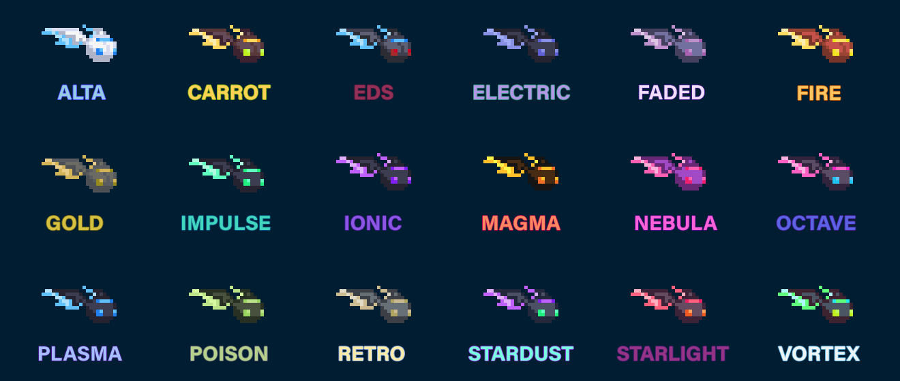
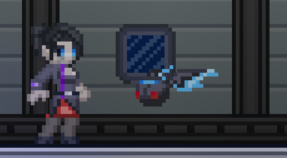

# Alta Ship Pet - Ignome

A small mod that replaces alta ship pet drones with ignomes - mysterious ethereal creatures, attracted to energy.

Currently includes 18 variations (check the screenshots).

Requires  [My Enternia](https://github.com/Ceterai/Enternia) to function.

That's it.

Also checkout:

- [Narfin Ship Pet](https://github.com/Ceterai/AltaNarfinShipPet)
- [Snugget Ship Pet](https://github.com/Ceterai/AltaSnuggetShipPet)
- [Roomba Ship Pet](https://github.com/Ceterai/AltaRoombaShipPet)

## Installation

These are all the different ways to obtain the mod - choose whichever one you like!

### Steam

Subscribe to this mod on Steam! [Link](https://steamcommunity.com/sharedfiles/filedetails/?id=3359794533)

### Starbound Forums

Get this mod on the official Chucklefish Forums: [Link](https://community.playstarbound.com/resources/alta-ship-pet-ignome.6326/)

### GitHub

1. Download the latest release or clone the repo;
1. Put the dowloaded/cloned folder into the `mods` folder in your Starbound directory.

> When downloading a release, you can choose between a `.zip` and a `.pak` version.

> Files, attached to releases, support direct public download links, so **can be used by servers** as well.

### Nexus Mods

- *COMING SOON*

## Screenshots

 
